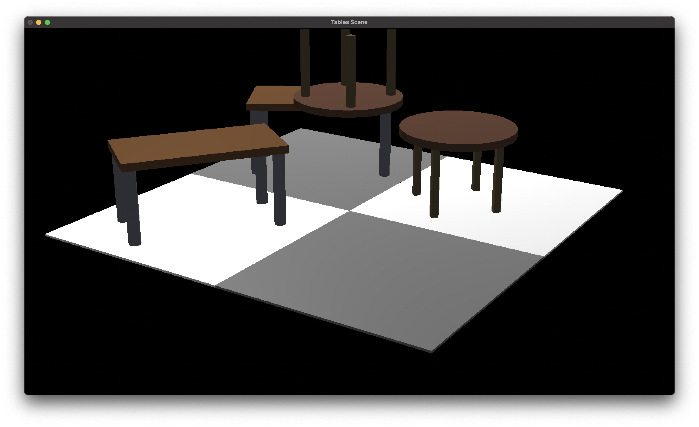

# OpenGL Scene Viewer

This is a simple OpenGL scene viewer. 
The goal is to model a scene using basic shapes such as cubes, spheres, torus, cylinders, and cones.

A scene is modeled using a scene graph.
Each node in the scene graph carries a transformation matrix.
This transformation matrix is used to position, orient and scale the node in the scene.
The nodes also carry material properties.
Each node inherits the material properties of its parent at the time of its creation.

This project uses the custom library GXLib. 
This library is a facade for OpenGL, made in Gustave Eiffel University.

## Building

We use CMake to build the project.

```
mkdir build
cd build
cmake ..
make
```

## Features

Scene graph handles homothety, rotation and translation.
This first kind of transformation is particular as it should not globally exceed 1.
A method can walk the scene graph and apply a transformation to each node to normalize homotheties.

To increase performance, the furthest shapes are rendered in a lower resolution. 
This is done by using a scaling factor on each node.

## Screenshots

### Tables
|  |  |
|---------------------|--------------------------|

### Pillars way
|  |  |
|----------------------|---------------------------|
